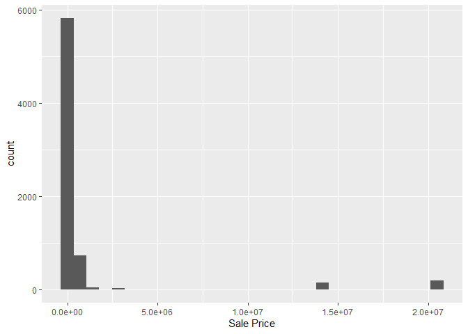
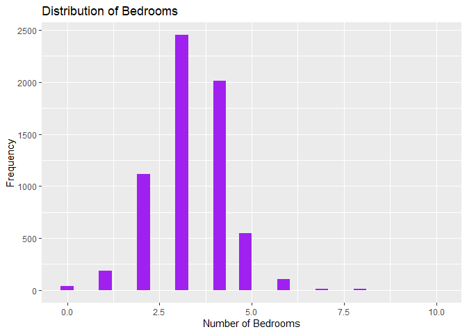
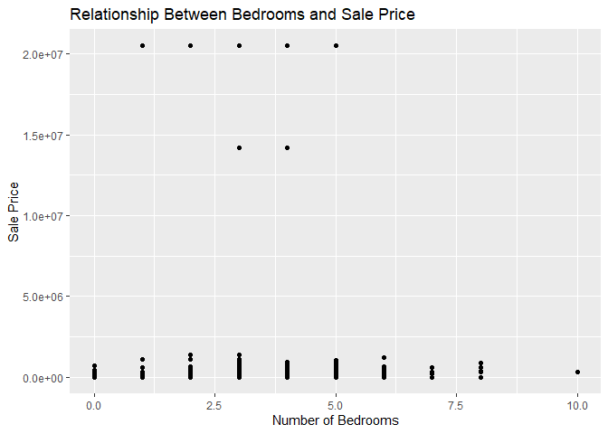

DS 202 - Lab \#2
================
Ananya Ramji

<!-- README.md is generated from README.Rmd. Please edit the README.Rmd file -->

# Lab report \#1

Follow the instructions posted at
<https://ds202-at-isu.github.io/labs.html> for the lab assignment. The
work is meant to be finished during the lab time, but you have time
until Monday evening to polish things.

Include your answers in this document (Rmd file). Make sure that it
knits properly (into the md file). Upload both the Rmd and the md file
to your repository.

All submissions to the github repo will be automatically uploaded for
grading once the due date is passed. Submit a link to your repository on
Canvas (only one submission per team) to signal to the instructors that
you are done with your submission.

``` r
#install.packages("classdata")
library(classdata) 
data(ames)
```

``` r
head(ames)
```

    ##    Parcel ID                       Address             Style
    ## 1 0903202160      1024 RIDGEWOOD AVE, AMES 1 1/2 Story Frame
    ## 2 0907428215 4503 TWAIN CIR UNIT 105, AMES     1 Story Frame
    ## 3 0909428070        2030 MCCARTHY RD, AMES     1 Story Frame
    ## 4 0923203160         3404 EMERALD DR, AMES     1 Story Frame
    ## 5 0520440010       4507 EVEREST  AVE, AMES              <NA>
    ## 6 0907275030       4512 HEMINGWAY DR, AMES     2 Story Frame
    ##                        Occupancy  Sale Date Sale Price Multi Sale YearBuilt
    ## 1 Single-Family / Owner Occupied 2022-08-12     181900       <NA>      1940
    ## 2                    Condominium 2022-08-04     127100       <NA>      2006
    ## 3 Single-Family / Owner Occupied 2022-08-15          0       <NA>      1951
    ## 4                      Townhouse 2022-08-09     245000       <NA>      1997
    ## 5                           <NA> 2022-08-03     449664       <NA>        NA
    ## 6 Single-Family / Owner Occupied 2022-08-16     368000       <NA>      1996
    ##   Acres TotalLivingArea (sf) Bedrooms FinishedBsmtArea (sf) LotArea(sf)  AC
    ## 1 0.109                 1030        2                    NA        4740 Yes
    ## 2 0.027                  771        1                    NA        1181 Yes
    ## 3 0.321                 1456        3                  1261       14000 Yes
    ## 4 0.103                 1289        4                   890        4500 Yes
    ## 5 0.287                   NA       NA                    NA       12493  No
    ## 6 0.494                 2223        4                    NA       21533 Yes
    ##   FirePlace              Neighborhood
    ## 1       Yes       (28) Res: Brookside
    ## 2        No    (55) Res: Dakota Ridge
    ## 3        No        (32) Res: Crawford
    ## 4        No        (31) Res: Mitchell
    ## 5        No (19) Res: North Ridge Hei
    ## 6       Yes   (37) Res: College Creek

``` r
colnames(ames)
```

    ##  [1] "Parcel ID"             "Address"               "Style"                
    ##  [4] "Occupancy"             "Sale Date"             "Sale Price"           
    ##  [7] "Multi Sale"            "YearBuilt"             "Acres"                
    ## [10] "TotalLivingArea (sf)"  "Bedrooms"              "FinishedBsmtArea (sf)"
    ## [13] "LotArea(sf)"           "AC"                    "FirePlace"            
    ## [16] "Neighborhood"

``` r
str(ames)
```

    ## Classes 'tbl_df', 'tbl' and 'data.frame':    6935 obs. of  16 variables:
    ##  $ Parcel ID            : chr  "0903202160" "0907428215" "0909428070" "0923203160" ...
    ##  $ Address              : chr  "1024 RIDGEWOOD AVE, AMES" "4503 TWAIN CIR UNIT 105, AMES" "2030 MCCARTHY RD, AMES" "3404 EMERALD DR, AMES" ...
    ##  $ Style                : Factor w/ 12 levels "1 1/2 Story Brick",..: 2 5 5 5 NA 9 5 5 5 5 ...
    ##  $ Occupancy            : Factor w/ 5 levels "Condominium",..: 2 1 2 3 NA 2 2 1 2 2 ...
    ##  $ Sale Date            : Date, format: "2022-08-12" "2022-08-04" ...
    ##  $ Sale Price           : num  181900 127100 0 245000 449664 ...
    ##  $ Multi Sale           : chr  NA NA NA NA ...
    ##  $ YearBuilt            : num  1940 2006 1951 1997 NA ...
    ##  $ Acres                : num  0.109 0.027 0.321 0.103 0.287 0.494 0.172 0.023 0.285 0.172 ...
    ##  $ TotalLivingArea (sf) : num  1030 771 1456 1289 NA ...
    ##  $ Bedrooms             : num  2 1 3 4 NA 4 5 1 3 4 ...
    ##  $ FinishedBsmtArea (sf): num  NA NA 1261 890 NA ...
    ##  $ LotArea(sf)          : num  4740 1181 14000 4500 12493 ...
    ##  $ AC                   : chr  "Yes" "Yes" "Yes" "Yes" ...
    ##  $ FirePlace            : chr  "Yes" "No" "No" "No" ...
    ##  $ Neighborhood         : Factor w/ 42 levels "(0) None","(13) Apts: Campus",..: 15 40 19 18 6 24 14 40 13 23 ...

Here are details for few of the columns.

1.  Parcel ID

Type: Character (or categorical) Description: A unique identifier for
each property. Expected Range: 10 digit numbers.

Address

Type: Character (or categorical) Description: The physical address of
the property. Expected Range: any address in Ames.

Style

Type: Character (or categorical) Description: The architectural style of
the property (e.g., ranch, colonial). Expected Range: Various story
frames.

2.  The variable of interest here is Sale Price.

3.  

``` r
summary(ames$`Sale Price`)
```

    ##     Min.  1st Qu.   Median     Mean  3rd Qu.     Max. 
    ##        0        0   170900  1017479   280000 20500000

Range for sale price is 20500000-0 (max-min) = 20500000

``` r
library(ggplot2)
```

``` r
ggplot(ames, aes(x = `Sale Price`)) + 
  geom_histogram()
```

    ## `stat_bin()` using `bins = 30`. Pick better value with `binwidth`.

<!-- -->

Shape: The distribution seems to be right skewed. Peaks: There seems to
be multiple peaks in the data. Common Values: The histogram shows that
low sale prices are most commonly represented. Oddities: The histogram
indicates that there are very few properties sold at high price points,
specifically at \$15,000,000 and \$20,000,000, as evidenced by the small
bars at these intervals.”

``` r
range_bedrooms <- range(ames$Bedrooms, na.rm = TRUE)
print(range_bedrooms)
```

    ## [1]  0 10

``` r
ggplot(ames, aes(x = Bedrooms)) +
  geom_histogram(fill = "purple") +
  labs(title = "Distribution of Bedrooms", x = "Number of Bedrooms", y = "Frequency")
```

    ## `stat_bin()` using `bins = 30`. Pick better value with `binwidth`.

    ## Warning: Removed 447 rows containing non-finite outside the scale range
    ## (`stat_bin()`).

<!-- --> Shape: It
seems to be uniformally distributed but skewed a little to the right.
Common Values: The most frequent number of bedrooms are from 3 to 4.
Outliers: Few houses have more than 7 bedrooms.

``` r
ggplot(data = ames, aes(x = Bedrooms, y = `Sale Price`)) +
  geom_point() +
  labs(title = "Relationship Between Bedrooms and Sale Price",
       x = "Number of Bedrooms",
       y = "Sale Price") 
```

    ## Warning: Removed 447 rows containing missing values or values outside the scale range
    ## (`geom_point()`).

<!-- -->

SCATTERPLOT

Most of the homes are sold for below \$200000 regardless of the number
of bedrooms. There is no relation between number of bedrooms and sale
price for the outliers shown above.

```{r NathanGraph}
ggplot(data = ames, aes(x = Bedrooms, y = `Acres`)) +
  geom_point() +
  labs(title = "Relationship Between Acres and Sale Price",
       x = "Acres",
       y = "Sale Price") 
```
SCATTERPLOT
